# dynamodb-api

Uma aplicação Go completa para CRUD de eventos, instrumentada com **OpenTelemetry** para observabilidade total. Suporta múltiplos backends de telemetria (Datadog, Jaeger, Prometheus/Grafana) e pode rodar como **HTTP Server** ou **AWS Lambda**.

## 📋 Índice

- [Visão Geral](#visão-geral)
- [Arquitetura](#arquitetura)
- [Estrutura do Projeto](#estrutura-do-projeto)
- [Como Usar](#como-usar)
- [Endpoints da API](#endpoints-da-api)
- [Variáveis de Ambiente](#variáveis-de-ambiente)
- [Modos de Execução](#modos-de-execução)
- [Telemetria](#telemetria)
- [Docker Compose](#docker-compose)
- [Imagens Datadog](#imagens-datadog)
- [Troubleshooting](#troubleshooting)

---

## Visão Geral

- **Language**: Go 1.25.5
- **Framework REST**: HTTP nativo (net/http)
- **Banco de Dados**: DynamoDB (ou MemoryDB para desenvolvimento)
- **Observabilidade**: OpenTelemetry (traces, métricas, logs)
- **Backends Suportados**: Datadog, Jaeger, Prometheus/Grafana
- **Modos de Execução**: HTTP Server, AWS Lambda
- **Containerização**: Docker + docker-compose

---

## Arquitetura

### Diagrama de Componentes

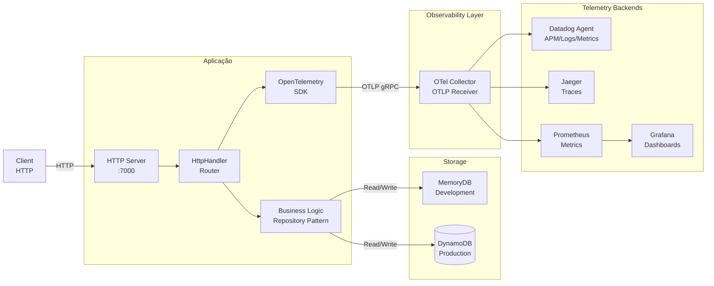

### Fluxo de Requisição Detalhado

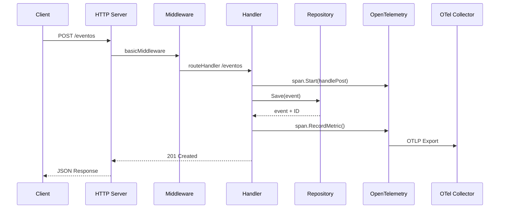

### Ciclo de Vida de um Evento

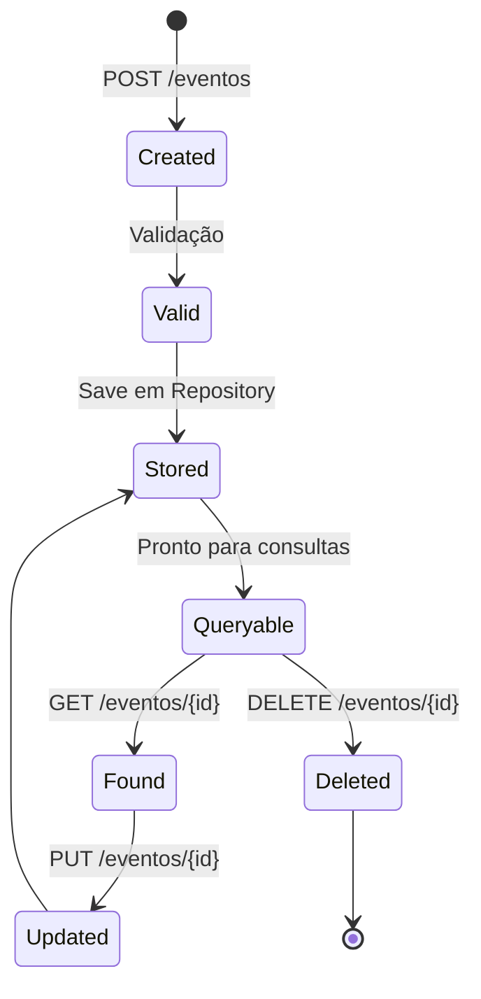

---

## Estrutura do Projeto

```
dynamodb-api/
├── main.go                       # Entry point
├── config.go                     # Configuração da aplicação
├── otel.go                       # Setup OpenTelemetry
├── go.mod                        # Dependências
├── config.json                   # Arquivo de configuração (gerado)
├── README.md                     # Este arquivo
│
├── apis/
│   ├── http_api.go              # HTTP Server
│   └── lambda_api.go            # AWS Lambda Handler
│
├── handlers/
│   ├── http_handler.go          # REST Handler
│   └── lambda_handler.go        # Lambda Handler
│
├── repositories/
│   ├── memorydb.go              # Em memória (desenvolvimento)
│   └── dynamodb.go              # AWS DynamoDB (produção)
│
├── interfaces/
│   ├── dynamodb_client.go       # Interface AWS SDK
│   └── repository.go            # Interface padrão
│
├── models/
│   ├── event.go                 # Modelo de Evento
│   └── error_response.go        # Modelo de Erro
│
├── extra/
│   ├── docker-compose.yaml      # Compose para Datadog/Jaeger/Prometheus
│   ├── otel-collector.yaml      # Config OTel Collector
│   ├── prometheus.yaml          # Config Prometheus
│   └── datadog_*.png            # Screenshots Datadog
│
└── dockerfile                    # Docker image
```

---

## Como Usar

### Pré-requisitos

- **Go 1.25.5+**
- **curl** (para testar endpoints)
- **Docker** (opcional, para container)

### Instalação e Execução

#### Localmente (Go)

```bash
# Clone ou entre no diretório
git clone https://github.com/flcamillo/dynamodb-api.git

# Baixe as dependências
go mod download

# Compile
go build -o dynamodb-api .

# Execute
./dynamodb-api
```

Ou utilize `go run` direto:

```bash
go run .
```

Na primeira execução, um `config.json` será criado com valores padrão:

```json
{
  "address": "0.0.0.0",
  "port": 7000,
  "record_ttl_minutes": 1440
}
```

---

## Endpoints da API

A API roda em `http://localhost:7000` por padrão.

### 1. Health Check

Verifica se a aplicação está saudável.

```bash
curl -v http://localhost:7000/health
```

**Resposta esperada:**
```
HTTP/1.1 200 OK
OK
```

---

### 2. Listar Eventos (GET /eventos)

Lista todos os eventos com opções de filtro por data e status code.

**Parâmetros de Query (opcionais):**

| Parâmetro | Tipo | Exemplo | Descrição |
|-----------|------|---------|-----------|
| `from` | RFC3339 | `2026-02-10T00:00:00Z` | Data inicial (padrão: 1 hora atrás) |
| `to` | RFC3339 | `2026-02-10T23:59:59Z` | Data final (padrão: agora) |
| `statusCode` | int | `200` | Filtro de status code (padrão: 0 = sem filtro) |

```bash
# Listar todos os eventos
curl -v "http://localhost:7000/eventos"

# Com filtro de data
curl -v "http://localhost:7000/eventos?from=2026-02-10T00:00:00Z&to=2026-02-10T23:59:59Z"

# Com filtro de status code
curl -v "http://localhost:7000/eventos?statusCode=200"

# Combinado
curl -v "http://localhost:7000/eventos?from=2026-02-10T00:00:00Z&statusCode=500"
```

**Resposta esperada:**
```json
[
  {
    "id": "550e8400-e29b-41d4-a716-446655440000",
    "date": "2026-02-10T12:00:00Z",
    "statusCode": 200,
    "statusMessage": "OK",
    "metadata": {
      "source": "api-module"
    }
  },
  ...
]
```

---

### 3. Buscar Evento por ID (GET /eventos/{id})

Recupera um evento específico pelo ID.

```bash
# Substituir <ID> pelo UUID real
curl -v "http://localhost:7000/eventos/550e8400-e29b-41d4-a716-446655440000"
```

**Resposta (200 OK):**
```json
{
  "id": "550e8400-e29b-41d4-a716-446655440000",
  "date": "2026-02-10T12:00:00Z",
  "statusCode": 200,
  "statusMessage": "OK",
  "metadata": {
    "source": "curl-sample"
  }
}
```

**Resposta (404 Not Found):**
```json
{
  "type": "about:blank",
  "title": "Not Found",
  "status": 404,
  "detail": "Event not found",
  "instance": "/eventos/invalid-id"
}
```

---

### 4. Criar Evento (POST /eventos)

Cria um novo evento e gera um UUID automaticamente.

**Estrutura do Evento:**

```ts
{
  "date": string,           // RFC3339 (obrigatório)
  "statusCode": int,        // HTTP status code (obrigatório)
  "statusMessage": string,  // Mensagem de status (obrigatório)
  "expiration": int64,      // TTL em segundos (opcional)
  "metadata": object        // Dados customizados (opcional)
}
```

**Exemplos:**

```bash
# Simples
curl -v -X POST http://localhost:7000/eventos \
  -H "Content-Type: application/json" \
  -d '{"date":"2026-02-10T12:00:00Z","statusCode":200,"statusMessage":"OK"}'

# Com metadata
curl -v -X POST http://localhost:7000/eventos \
  -H "Content-Type: application/json" \
  -d '{
    "date":"2026-02-10T12:00:00Z",
    "statusCode":201,
    "statusMessage":"Created",
    "metadata":{
      "source":"curl-sample",
      "user":"john.doe",
      "request_id":"abc-123-def"
    }
  }'

# Com expiration (expira em 3600 segundos)
curl -v -X POST http://localhost:7000/eventos \
  -H "Content-Type: application/json" \
  -d '{
    "date":"2026-02-10T12:00:00Z",
    "statusCode":200,
    "statusMessage":"OK",
    "expiration":3600,
    "metadata":{"ttl":"1h"}
  }'
```

**Resposta esperada (201 Created):**
```json
{
  "id": "550e8400-e29b-41d4-a716-446655440001",
  "date": "2026-02-10T12:00:00Z",
  "statusCode": 201,
  "statusMessage": "Created",
  "metadata": {
    "source": "curl-sample"
  }
}
```

---

### 5. Atualizar Evento (PUT /eventos/{id})

Atualiza um evento existente (substitui completamente).

```bash
# Atualizar com novo status
curl -v -X PUT http://localhost:7000/eventos/550e8400-e29b-41d4-a716-446655440001 \
  -H "Content-Type: application/json" \
  -d '{
    "date":"2026-02-10T13:00:00Z",
    "statusCode":500,
    "statusMessage":"Internal Server Error",
    "metadata":{"updated":"yes","reason":"test"}
  }'

# Atualizar com dados parciais (recomenda-se enviar tudo)
curl -v -X PUT http://localhost:7000/eventos/550e8400-e29b-41d4-a716-446655440001 \
  -H "Content-Type: application/json" \
  -d '{
    "date":"2026-02-10T14:00:00Z",
    "statusCode":200,
    "statusMessage":"OK"
  }'
```

**Resposta esperada (201 Created):**
```json
{
  "id": "550e8400-e29b-41d4-a716-446655440001",
  "date": "2026-02-10T13:00:00Z",
  "statusCode": 500,
  "statusMessage": "Internal Server Error",
  "metadata": {
    "updated": "yes",
    "reason": "test"
  }
}
```

---

### 6. Deletar Evento (DELETE /eventos/{id})

Remove um evento da base de dados.

```bash
curl -v -X DELETE http://localhost:7000/eventos/550e8400-e29b-41d4-a716-446655440001
```

**Resposta esperada (204 No Content):**
```
HTTP/1.1 204 No Content
```

---

## Variáveis de Ambiente

### OpenTelemetry

| Variável | Padrão | Descrição |
|----------|--------|-----------|
| `OTEL_SERVICE_NAME` | (obrigatório) | Nome do serviço (ex: `dynamodb-api`) |
| `OTEL_EXPORTER_OTLP_ENDPOINT` | `http://localhost:4317` | Endpoint OTLP (gRPC) |
| `OTEL_EXPORTER_OTLP_HEADERS` | (vazio) | Headers customizados (ex: `DD-API-KEY=xxx`) |
| `OTEL_TRACES_SAMPLER` | `always_on` | Sampler de traces (`always_on`, `parent_based_traceidratio`) |
| `OTEL_TRACES_SAMPLER_ARG` | `1.0` | Argumento do sampler (0-1) |
| `OTEL_RESOURCE_ATTRIBUTES` | (vazio) | Atributos de recurso (`key=value,key2=value2`) |

### Datadog

| Variável | Descrição |
|----------|-----------|
| `DD_API_KEY` | Chave da API Datadog |
| `DD_AGENT_HOST` | Host do Datadog Agent (ex: `localhost`) |
| `DD_TRACE_AGENT_PORT` | Porta do Trace Agent (ex: `8126`) |
| `DD_ENV` | Ambiente (ex: `dev`, `staging`, `prod`) |
| `DD_SERVICE` | Nome do serviço (ex: `dynamodb-api`) |
| `DD_VERSION` | Versão da aplicação |

### Exemplo Completo

```bash
# Datadog via OTLP HTTP
export OTEL_SERVICE_NAME=dynamodb-api
export OTEL_EXPORTER_OTLP_ENDPOINT=http://localhost:4318
export OTEL_EXPORTER_OTLP_HEADERS="DD-API-KEY=your-datadog-api-key"
export OTEL_TRACES_SAMPLER=always_on
export DD_ENV=development
export DD_SERVICE=dynamodb-api

# Ou Jaeger
export OTEL_SERVICE_NAME=dynamodb-api
export OTEL_EXPORTER_OTLP_ENDPOINT=http://localhost:4317
export OTEL_TRACES_SAMPLER=always_on

# Ou Prometheus (métricas)
export OTEL_METRICS_EXPORTER=prometheus
export OTEL_EXPORTER_PROMETHEUS_PORT=9464
```

---

## Modos de Execução

### HTTP Server (Padrão)

A aplicação roda como um servidor HTTP tradicional listening em `0.0.0.0:7000`.

```bash
go run .
# Logs:
# INFO: starting server on: 0.0.0.0:7000
```

Acesse via HTTP:
```bash
curl http://localhost:7000/health
```

---

### AWS Lambda

Para usar como Lambda, comente a linha de inicialização HTTP em `main.go` e descomente o handler Lambda.

**Arquivos relevantes:**
- `apis/lambda_api.go`: Configuração do Lambda
- `handlers/lambda_handler.go`: Handlers específicos para Lambda

**Exemplo payload Lambda:**

```json
{
  "resource": "/eventos",
  "httpMethod": "POST",
  "body": "{\"date\":\"2026-02-10T12:00:00Z\",\"statusCode\":200,\"statusMessage\":\"OK\"}"
}
```

---

## Telemetria

### OpenTelemetry SDK

A aplicação instrumenta automaticamente:

1. **Traces**: Criação de spans para cada request
2. **Métricas**: Contadores e histogramas de requisições
3. **Logs**: Estruturados com contexto de trace

**Componentes instrumentados:**
- HTTP handler (todas as rotas)
- Repository (operações de banco)
- JSON encoding/decoding
- Validações

### Datadog

Coleta traces, métricas e logs via OTLP.

**Screenshot da integração:**

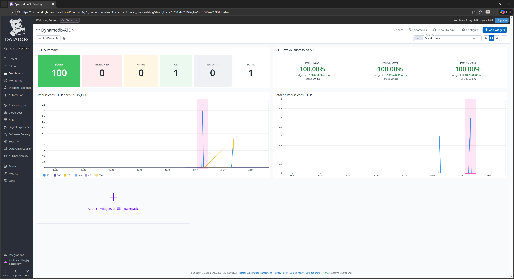

**Componentes do Datadog:**

- **APM (Application Performance Monitoring)**: Traces de requisições
- **Custom Metrics**: Contadores de requisições por rota
- **Logs**: Logs estruturados com context

---

### Jaeger

Para traçamento distribuído com Jaeger:

```bash
# Configure endpoint para Jaeger
export OTEL_EXPORTER_OTLP_ENDPOINT=http://localhost:4317
export OTEL_SERVICE_NAME=dynamodb-api
export OTEL_TRACES_SAMPLER=always_on

go run .
```

Acesse Jaeger em `http://localhost:16686`

---

### Prometheus & Grafana

Para métricas com Prometheus e visualização com Grafana:

```bash
# Configure para Prometheus
export OTEL_METRICS_EXPORTER=prometheus
export OTEL_EXPORTER_PROMETHEUS_PORT=9464

go run .
```

- Prometheus scraping: `http://localhost:9464/metrics`
- Grafana: `http://localhost:3000`

---

## Docker Compose

Arquivos de orquestração em `extra/`:

### docker-compose.yaml

Contém serviços pré-configurados:
- Aplicação dynamodb-api
- Datadog Agent
- OpenTelemetry Collector
- Jaeger
- Prometheus
- Grafana

**Uso:**

```bash
cd extra
docker-compose up -d

# Acompanhar logs
docker-compose logs -f dynamodb-api

# Parar
docker-compose down
```

### otel-collector.yaml

Configuração do OpenTelemetry Collector:
- Receptores: OTLP (gRPC)
- Processadores: Batch, Memory limiter
- Exportadores: Datadog, Jaeger, Prometheus

### prometheus.yaml

Scrape config para coletar métricas da aplicação.

---

## Imagens Datadog

Capturas de tela da integração Datadog estão em `extra/`:

### APM (Application Performance Monitoring)

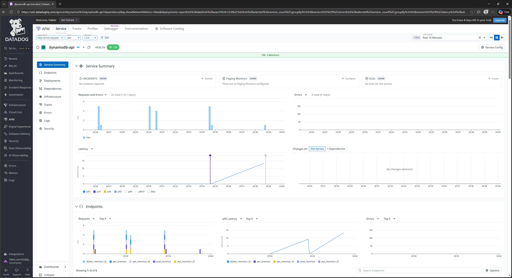
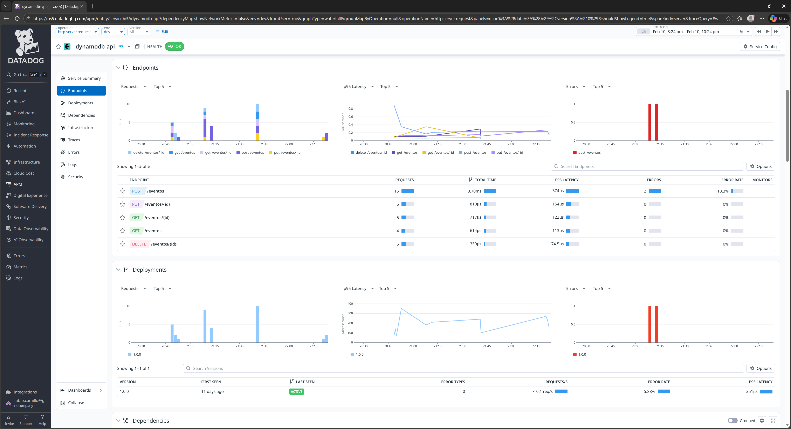
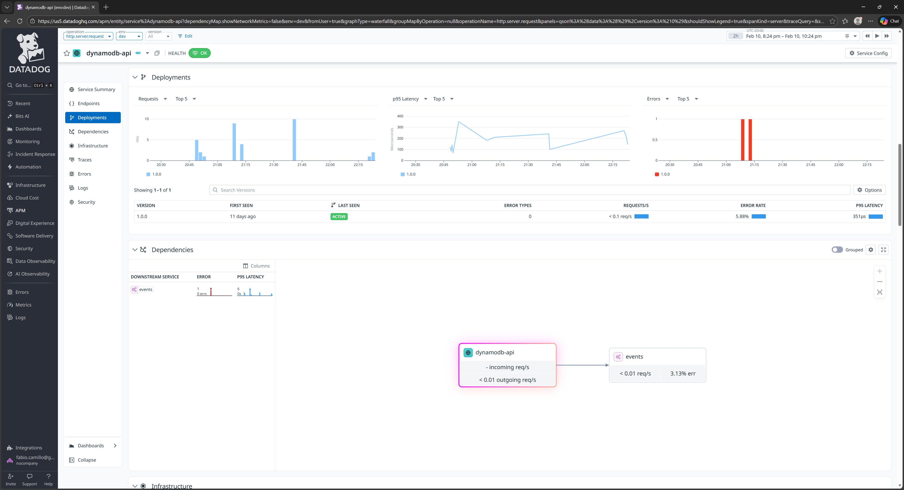
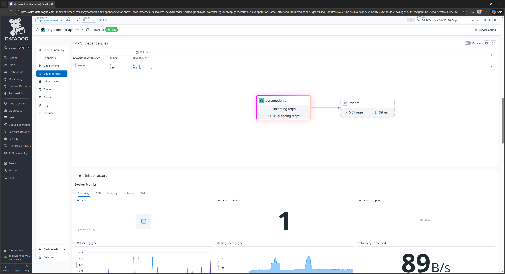
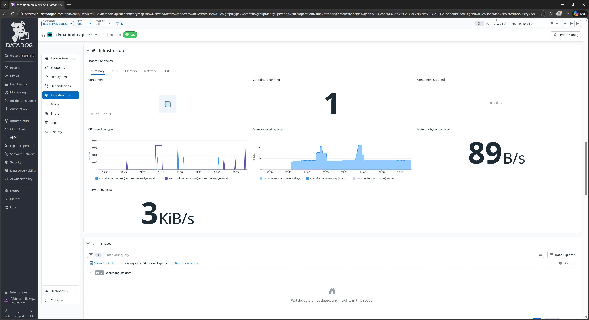
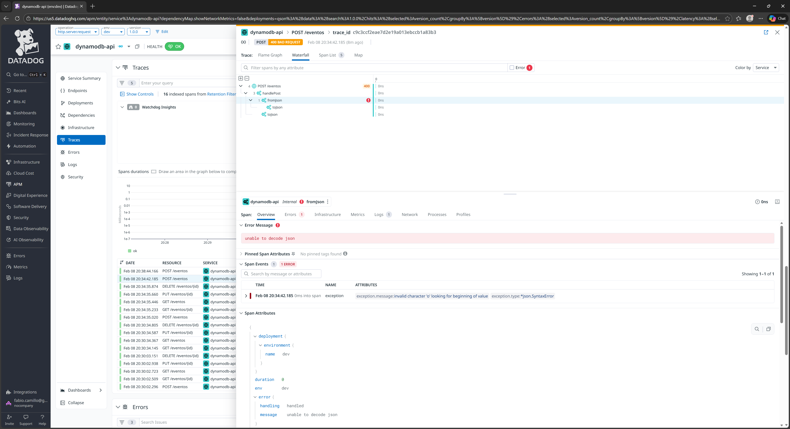
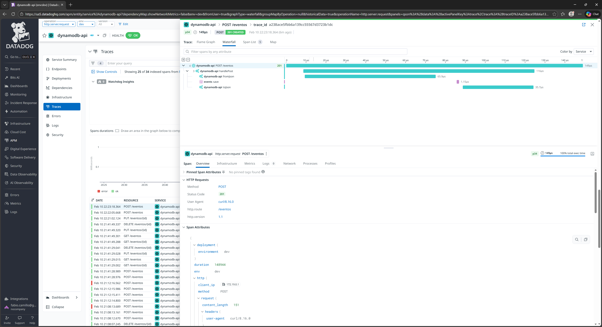
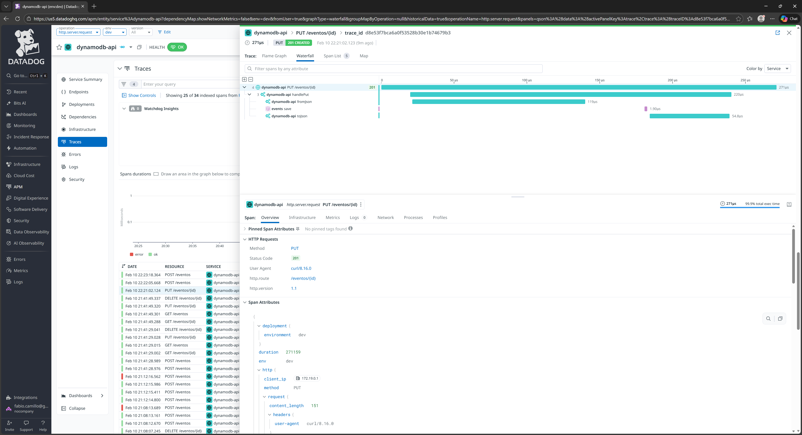
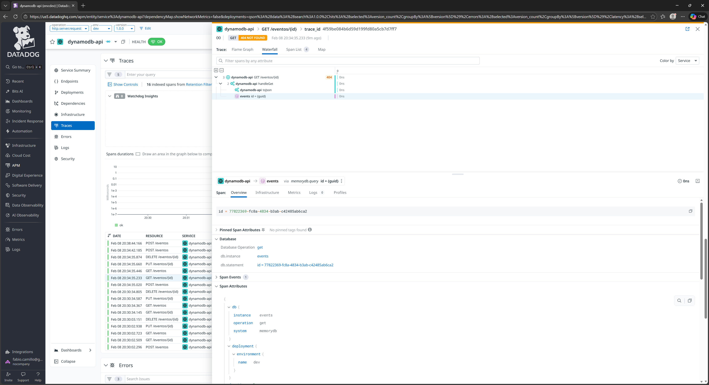
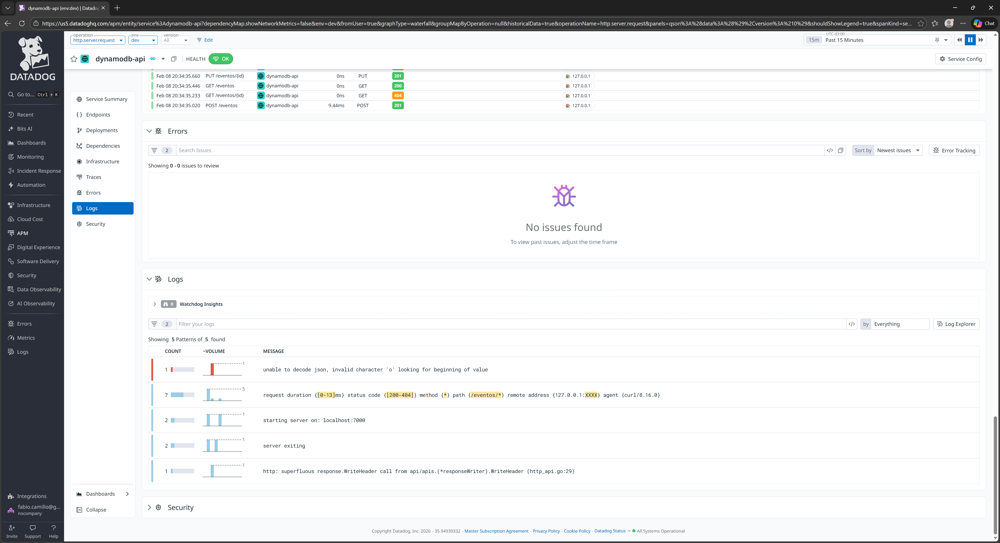

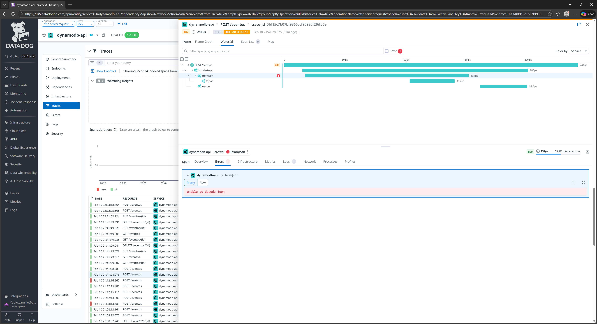

### Métricas Customizadas

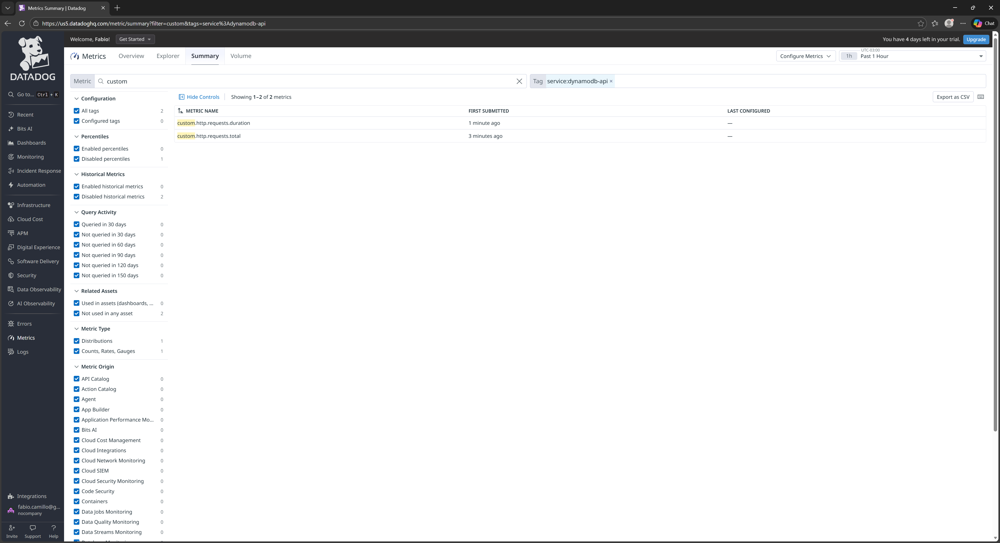

### Dashboard


### Logs

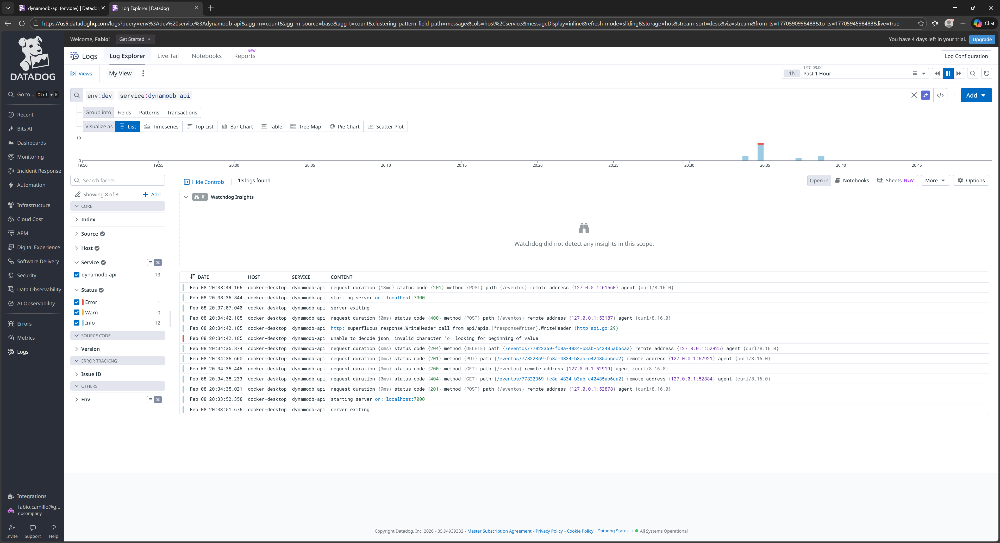

---

## Modelo de Dados

### Event

```go
type Event struct {
    Id            string            // UUID (gerado automaticamente)
    Date          time.Time         // RFC3339 (obrigatório)
    StatusCode    int               // HTTP status code (obrigatório)
    StatusMessage string            // Mensagem (obrigatório)
    Expiration    int64             // TTL em segundos (opcional)
    Metadata      map[string]string // Dados customizados (opcional)
}
```

**Validações:**
- `Date`: não pode ser zero
- `StatusCode`: deve ser >= 0

---

## Estrutura de Resposta de Erro

```json
{
  "type": "about:blank",
  "title": "Bad Request",
  "status": 400,
  "detail": "Missing event ID in URL",
  "instance": "/eventos"
}
```

RFC 7807 Problem Details for HTTP APIs

---

## Configuration File (config.json)

Gerado automaticamente na primeira execução:

```json
{
  "address": "0.0.0.0",
  "port": 7000,
  "record_ttl_minutes": 1440
}
```

Modifique conforme necessário:

```json
{
  "address": "127.0.0.1",
  "port": 8080,
  "record_ttl_minutes": 60
}
```

---

## Troubleshooting

### Problema: "connection refused" ao tentar acessar

**Causa**: Aplicação não iniciada ou listening em porta diferente

**Solução**:
```bash
# Verifique se está rodando
netstat -ano | findstr :7000

# Ou inicie com port customizado em config.json
```

---

### Problema: "Unable to export traces/metrics"

**Causa**: OpenTelemetry Collector não está accessible

**Solução**:
```bash
# Verifique o endpoint
export OTEL_EXPORTER_OTLP_ENDPOINT=http://localhost:4317

# Se usar docker-compose, ensure collector is running
docker-compose logs otel-collector
```

---

### Problema: Eventos não persistem

**Causa**: Usando MemoryDB (em memória), dados são perdidos ao reiniciar

**Solução**: Configure DynamoDB em `main.go` ou use persistent storage

```bash
# Descomente em main.go:
# applicationConfig.Repository = repositories.NewDynamoDBRepository(...)
```

---

## Dependências Principais

| Pacote | Versão | Uso |
|--------|--------|-----|
| `github.com/aws/aws-lambda-go` | v1.52.0 | AWS Lambda support |
| `github.com/aws/aws-sdk-go-v2` | v1.41.1 | AWS SDK |
| `github.com/google/uuid` | v1.6.0 | UUID generation |
| `go.opentelemetry.io/otel` | v1.40.0 | OpenTelemetry |
| `go.opentelemetry.io/contrib/instrumentation/net/http/otelhttp` | v0.65.0 | HTTP instrumentation |

---

## Performance

- **Timeout de requisição**: 30s (read) / 30s (write)
- **Timeout idle**: 60s
- **Max header bytes**: 1MB
- **Batch timeout OTel**: 5s
- **Métrica interval OTel**: 5s

---

## Segurança

- ✅ Validação de entrada (struct validation)
- ✅ Error handling robusto
- ✅ Headers HTTP customizados
- ✅ Context timeouts
- ✅ Logging estruturado com trace ID

---

## Contributing

1. Crie um branch para sua feature (`git checkout -b feature/AmazingFeature`)
2. Commit suas mudanças (`git commit -m 'Add some AmazingFeature'`)
3. Push para o branch (`git push origin feature/AmazingFeature`)
4. Abra um Pull Request

---

## License

Este projeto é fornecido como exemplo de aplicação instrumentada com OpenTelemetry.

---

**Última atualização**: Fevereiro 10, 2026
