# DynamoDB API - Documentação Completa

Uma API RESTful robusta construída em Go para gerenciar eventos utilizando AWS DynamoDB ou um repositório em memória. A aplicação oferece suporte a múltiplos modos de deployment (HTTP Server e AWS Lambda), com telemetria integrada via OpenTelemetry.

## 📋 Índice

- [Características](#características)
- [Arquitetura](#arquitetura)
- [Requisitos](#requisitos)
- [Instalação e Configuração](#instalação-e-configuração)
- [Executando a Aplicação](#executando-a-aplicação)
- [Endpoints da API](#endpoints-da-api)
- [Exemplos com cURL](#exemplos-com-curl)
- [Estrutura do Projeto](#estrutura-do-projeto)
- [Configuração](#configuração)
- [Telemetria e Observabilidade](#telemetria-e-observabilidade)

## ✨ Características

- ✅ **API RESTful completa** para CRUD de eventos
- ✅ **Suporte dual**: HTTP Server + AWS Lambda
- ✅ **Repositórios plugáveis**: DynamoDB e In-Memory
- ✅ **OpenTelemetry integrado** para observabilidade
- ✅ **Métricas e Tracing** automáticos
- ✅ **Validação de dados** robusta
- ✅ **TTL (Time To Live)** para expiração automática de registros
- ✅ **Suporte a metadata** customizável por evento
- ✅ **Testes unitários** com 90%+ de cobertura

## 🏗️ Arquitetura

### Diagrama de Componentes

```mermaid
graph TB
    Client["🖥️ Cliente HTTP"]
    Lambda["⚡ AWS Lambda"]
    
    Client -->|HTTP| API["🌐 HTTP API<br/>Port 7000"]
    Lambda -->|Event| LambdaAPI["📦 Lambda API"]
    
    API -->|Request| HTTPHandler["🔧 HTTP Handler"]
    LambdaAPI -->|Event| LambdaHandler["🔧 Lambda Handler"]
    
    HTTPHandler -->|CRUD| Repo["📊 Repository Interface"]
    LambdaHandler -->|CRUD| Repo
    
    Repo -->|Config| DynamoDB["🗄️ DynamoDB"]
    Repo -->|Config| MemoryDB["💾 In-Memory DB"]
    
    DynamoDB -->|AWS SDK| AWS["☁️ AWS Cloud"]
    
    HTTPHandler -->|Metrics| OTel["📈 OpenTelemetry"]
    LambdaHandler -->|Tracing| OTel
    
    OTel -->|Export| Collector["📡 OTEL Collector<br/>:4317"]
    Collector -->|Prometheus| Prom["📊 Prometheus"]
    Collector -->|Jaeger| Jaeger["🔍 Jaeger"]
```



### Fluxo de Dados


### Estrutura de Camadas


## 📦 Requisitos

- **Go**: 1.21+
- **AWS SDK for Go**: v2
- **Docker**: (opcional, para DynamoDB local e OTEL Collector)
- **curl** ou **Postman**: para testar endpoints

### Dependências Go

```bash
go get github.com/aws/aws-sdk-go-v2
go get github.com/aws/aws-lambda-go
go get go.opentelemetry.io/otel
go get github.com/google/uuid
```

## 🚀 Instalação e Configuração

### 1. Clone o Repositório

```bash
cd d:\Fabio\Go\src\dynamodb-api
```

### 2. Instale as Dependências

```bash
go mod download
go mod tidy
```

### 3. Configure o arquivo `config.json`

```json
{
  "address": "localhost",
  "port": 7000,
  "record_ttl_minutes": 1440
}
```

**Parâmetros:**
- `address`: Endereço de binding do servidor (default: 0.0.0.0)
- `port`: Porta do servidor (default: 7000)
- `record_ttl_minutes`: Tempo de vida dos registros em minutos (default: 1440 = 24 horas)

### 4. Configure Variáveis de Ambiente (AWS)

```bash
# Para usar AWS DynamoDB real
export AWS_REGION=us-east-1
export AWS_ACCESS_KEY_ID=seu_access_key
export AWS_SECRET_ACCESS_KEY=seu_secret_key

# Para usar DynamoDB local
export AWS_ENDPOINT_URL_DYNAMODB=http://localhost:8000
export AWS_REGION=local
```

## ▶️ Executando a Aplicação

### Opção 1: HTTP Server Local

```bash
go run main.go
```

A API estará disponível em `http://localhost:7000`

### Opção 2: Com Docker Compose (DynamoDB Local)

```bash
# Inicie os serviços
docker-compose -f extra/docker-compose.yml up -d

# Execute a aplicação
go run main.go
```

### Opção 3: Build e Executar Binário

```bash
# Build
go build -o api .

# Execute
./api
```

### Opção 4: AWS Lambda

```bash
# Build para Lambda
GOOS=linux GOARCH=arm64 go build -o bootstrap .

# Zipar
zip lambda.zip bootstrap

# Deploy via AWS CLI
aws lambda create-function \
  --function-name dynamodb-api \
  --runtime provided.al2 \
  --role arn:aws:iam::ACCOUNT:role/ROLE \
  --handler bootstrap \
  --zip-file fileb://lambda.zip
```

## 📡 Endpoints da API

### 1. Health Check

Verifica se a aplicação está ativa.

```
GET /health
```

**Resposta:** `200 OK`

---

### 2. Criar Evento

Cria um novo evento.

```
POST /eventos
Content-Type: application/json
```

**Request Body:**
```json
{
  "date": "2024-01-29T10:30:00Z",
  "statusCode": 200,
  "statusMessage": "Operação bem-sucedida",
  "metadata": {
    "user_id": "123",
    "request_id": "abc-def-ghi"
  }
}
```

**Response (201 Created):**
```json
{
  "id": "550e8400-e29b-41d4-a716-446655440000",
  "date": "2024-01-29T10:30:00Z",
  "statusCode": 200,
  "statusMessage": "Operação bem-sucedida",
  "expiration": 1706633400,
  "metadata": {
    "user_id": "123",
    "request_id": "abc-def-ghi"
  }
}
```

---

### 3. Obter Evento

Recupera um evento específico pelo ID.

```
GET /eventos/{id}
```

**Parâmetros:**
- `id` (path): UUID do evento

**Response (200 OK):**
```json
{
  "id": "550e8400-e29b-41d4-a716-446655440000",
  "date": "2024-01-29T10:30:00Z",
  "statusCode": 200,
  "statusMessage": "Operação bem-sucedida",
  "expiration": 1706633400,
  "metadata": {
    "user_id": "123",
    "request_id": "abc-def-ghi"
  }
}
```

---

### 4. Atualizar Evento

Atualiza um evento existente.

```
PUT /eventos/{id}
Content-Type: application/json
```

**Request Body:**
```json
{
  "date": "2024-01-29T11:00:00Z",
  "statusCode": 201,
  "statusMessage": "Criado com sucesso",
  "metadata": {
    "user_id": "123",
    "request_id": "xyz-123"
  }
}
```

**Response (200 OK):**
```json
{
  "id": "550e8400-e29b-41d4-a716-446655440000",
  "date": "2024-01-29T11:00:00Z",
  "statusCode": 201,
  "statusMessage": "Criado com sucesso",
  "expiration": 1706636800,
  "metadata": {
    "user_id": "123",
    "request_id": "xyz-123"
  }
}
```

---

### 5. Deletar Evento

Remove um evento específico.

```
DELETE /eventos/{id}
```

**Response (200 OK):**
```json
{
  "id": "550e8400-e29b-41d4-a716-446655440000",
  "date": "2024-01-29T10:30:00Z",
  "statusCode": 200,
  "statusMessage": "Operação bem-sucedida",
  "expiration": 1706633400,
  "metadata": {
    "user_id": "123"
  }
}
```

---

### 6. Listar Eventos (Find)

Lista eventos filtrando por data e status code.

```
GET /eventos?startDate=2024-01-29T00:00:00Z&endDate=2024-01-30T00:00:00Z&statusCode=200
```

**Parâmetros Query:**
- `startDate` (obrigatório): Data inicial (RFC3339)
- `endDate` (obrigatório): Data final (RFC3339)
- `statusCode` (obrigatório): Código HTTP para filtrar

**Response (200 OK):**
```json
{
  "items": [
    {
      "id": "550e8400-e29b-41d4-a716-446655440000",
      "date": "2024-01-29T10:30:00Z",
      "statusCode": 200,
      "statusMessage": "OK",
      "expiration": 1706633400
    }
  ],
  "total": 1
}
```

---

## 📝 Exemplos com cURL

### Pré-requisitos

Certifique-se de que a API está rodando em `http://localhost:7000`

### 1. Health Check

```bash
curl -X GET http://localhost:7000/health
```

**Saída esperada:**
```
OK
```

---

### 2. Criar um Evento

```bash
curl -X POST http://localhost:7000/eventos \
  -H "Content-Type: application/json" \
  -d '{
    "date": "2024-01-29T10:30:00Z",
    "statusCode": 200,
    "statusMessage": "Operação bem-sucedida",
    "metadata": {
      "user_id": "user-123",
      "request_id": "req-abc-def"
    }
  }'
```

**Resposta:**
```json
{
  "id": "8f5c9e1a-2b3c-4d5e-6f7g-8h9i0j1k2l3m",
  "date": "2024-01-29T10:30:00Z",
  "statusCode": 200,
  "statusMessage": "Operação bem-sucedida",
  "expiration": 1706628600,
  "metadata": {
    "user_id": "user-123",
    "request_id": "req-abc-def"
  }
}
```

💡 **Salvar o ID para os próximos exemplos:**

```bash
EVENT_ID="8f5c9e1a-2b3c-4d5e-6f7g-8h9i0j1k2l3m"
```

---

### 3. Obter um Evento

```bash
curl -X GET http://localhost:7000/eventos/$EVENT_ID
```

**Resposta:**
```json
{
  "id": "8f5c9e1a-2b3c-4d5e-6f7g-8h9i0j1k2l3m",
  "date": "2024-01-29T10:30:00Z",
  "statusCode": 200,
  "statusMessage": "Operação bem-sucedida",
  "expiration": 1706628600,
  "metadata": {
    "user_id": "user-123",
    "request_id": "req-abc-def"
  }
}
```

---

### 4. Listar Eventos por Período

```bash
curl -X GET "http://localhost:7000/eventos?startDate=2024-01-28T00:00:00Z&endDate=2024-01-30T23:59:59Z&statusCode=200"
```

**Resposta:**
```json
{
  "items": [
    {
      "id": "8f5c9e1a-2b3c-4d5e-6f7g-8h9i0j1k2l3m",
      "date": "2024-01-29T10:30:00Z",
      "statusCode": 200,
      "statusMessage": "Operação bem-sucedida",
      "expiration": 1706628600
    }
  ],
  "total": 1
}
```

---

### 5. Atualizar um Evento

```bash
curl -X PUT http://localhost:7000/eventos/$EVENT_ID \
  -H "Content-Type: application/json" \
  -d '{
    "date": "2024-01-29T11:45:00Z",
    "statusCode": 201,
    "statusMessage": "Criado com sucesso",
    "metadata": {
      "user_id": "user-456",
      "updated_by": "admin",
      "request_id": "req-xyz-789"
    }
  }'
```

**Resposta:**
```json
{
  "id": "8f5c9e1a-2b3c-4d5e-6f7g-8h9i0j1k2l3m",
  "date": "2024-01-29T11:45:00Z",
  "statusCode": 201,
  "statusMessage": "Criado com sucesso",
  "expiration": 1706632200,
  "metadata": {
    "user_id": "user-456",
    "updated_by": "admin",
    "request_id": "req-xyz-789"
  }
}
```

---

### 6. Deletar um Evento

```bash
curl -X DELETE http://localhost:7000/eventos/$EVENT_ID
```

**Resposta:**
```json
{
  "id": "8f5c9e1a-2b3c-4d5e-6f7g-8h9i0j1k2l3m",
  "date": "2024-01-29T11:45:00Z",
  "statusCode": 201,
  "statusMessage": "Criado com sucesso",
  "expiration": 1706632200,
  "metadata": {
    "user_id": "user-456",
    "updated_by": "admin"
  }
}
```

---

### 7. Múltiplas Operações em Sequência

```bash
#!/bin/bash

API="http://localhost:7000"

# 1. Health Check
echo "=== Health Check ==="
curl -s $API/health
echo -e "\n"

# 2. Criar 3 eventos
echo "=== Criando Eventos ==="
IDS=()
for i in {1..3}; do
  RESPONSE=$(curl -s -X POST $API/eventos \
    -H "Content-Type: application/json" \
    -d "{
      \"date\": \"2024-01-29T$(printf '%02d' $((9+i))):00:00Z\",
      \"statusCode\": $((200 + i*50)),
      \"statusMessage\": \"Event $i\",
      \"metadata\": {
        \"sequence\": \"$i\",
        \"type\": \"batch\"
      }
    }")
  
  ID=$(echo $RESPONSE | jq -r '.id')
  IDS+=($ID)
  echo "Evento $i criado: $ID"
done
echo ""

# 3. Listar todos
echo "=== Listando Eventos ==="
curl -s -X GET "$API/eventos?startDate=2024-01-28T00:00:00Z&endDate=2024-01-30T23:59:59Z&statusCode=200" | jq '.'
echo ""

# 4. Atualizar primeiro evento
echo "=== Atualizando Evento ==="
curl -s -X PUT $API/eventos/${IDS[0]} \
  -H "Content-Type: application/json" \
  -d '{
    "date": "2024-01-29T15:30:00Z",
    "statusCode": 200,
    "statusMessage": "Updated",
    "metadata": {"status": "modified"}
  }' | jq '.'
echo ""

# 5. Deletar segundo evento
echo "=== Deletando Evento ==="
curl -s -X DELETE $API/eventos/${IDS[1]} | jq '.'
echo ""

# 6. Listar novamente
echo "=== Listando Após Deleção ==="
curl -s -X GET "$API/eventos?startDate=2024-01-28T00:00:00Z&endDate=2024-01-30T23:59:59Z&statusCode=250" | jq '.'
```

---

## 📂 Estrutura do Projeto

```
dynamodb-api/
├── main.go                 # Entrada principal da aplicação
├── config.go              # Gerenciamento de configuração
├── config.json            # Arquivo de configuração
├── otel.go                # Setup OpenTelemetry
│
├── models/                # Modelos de dados
│   ├── event.go          # Estrutura do Event
│   ├── event_test.go     # Testes do Event
│   ├── error_response.go # Estrutura de erro
│   └── paginated_response.go # Resposta paginada
│
├── handlers/              # Handlers de requisição
│   ├── http_handler.go   # Implementação HTTP
│   ├── lambda_handler.go # Implementação Lambda
│   └── *_test.go         # Testes unitários
│
├── repositories/          # Implementações de armazenamento
│   ├── dynamodb.go       # Cliente DynamoDB
│   ├── memorydb.go       # Armazenamento em memória
│   └── *_test.go         # Testes unitários
│
├── interfaces/            # Interfaces do projeto
│   ├── dynamodb_client.go
│   ├── log.go
│   └── repository.go
│
├── logs/                  # Sistema de logging
│   ├── stdout.go         # Logger padrão
│   └── stdout_test.go    # Testes
│
├── apis/                  # API HTTP e Lambda
│   ├── http_api.go       # Configuração HTTP
│   ├── lambda_api.go     # Configuração Lambda
│   └── *_test.go         # Testes
│
├── extra/                 # Recursos adicionais
│   ├── docker-compose.yml
│   ├── otel-collector.yaml
│   └── prometheus.yaml
│
├── go.mod                # Dependências Go
├── go.sum                # Checksum das dependências
└── README.md             # Este arquivo
```

---

## ⚙️ Configuração

### Arquivo `config.json`

```json
{
  "address": "0.0.0.0",
  "port": 7000,
  "record_ttl_minutes": 1440
}
```

**Parâmetros:**

| Parâmetro | Tipo | Padrão | Descrição |
|-----------|------|--------|-----------|
| `address` | string | `0.0.0.0` | Endereço para bind do servidor |
| `port` | int | `7000` | Porta do servidor HTTP |
| `record_ttl_minutes` | int64 | `1440` | TTL dos registros em minutos |

### Variáveis de Ambiente

```bash
# AWS Configuration
AWS_REGION=us-east-1
AWS_ACCESS_KEY_ID=xxxxx
AWS_SECRET_ACCESS_KEY=xxxxx

# DynamoDB Local
AWS_ENDPOINT_URL_DYNAMODB=http://localhost:8000

# OpenTelemetry
OTEL_EXPORTER_OTLP_ENDPOINT=http://localhost:4317
OTEL_SDK_DISABLED=false
```

---

## 📊 Telemetria e Observabilidade

### OpenTelemetry

A aplicação exporta **traces** e **métricas** automaticamente.

**Métricas Coletadas:**
- `post.requests` - Número de requisições POST
- `get.requests` - Número de requisições GET
- `put.requests` - Número de requisições PUT
- `delete.requests` - Número de requisições DELETE
- `find.requests` - Número de requisições FIND

**Traces:**
- Cada operação de repositório é rastreada
- Latência de cada operação é medida
- Erros são registrados com contexto

### Docker Compose para Observabilidade

```bash
# Inicie os serviços de observabilidade
docker-compose -f extra/docker-compose.yml up -d

# Acesse o Jaeger
open http://localhost:16686

# Acesse o Prometheus
open http://localhost:9090
```

### Exemplo de Consulta Prometheus

```promql
# Taxa de requisições por segundo
rate(post.requests[1m])

# Requisições por tipo
sum by(method) (rate(requests[5m]))

# Erros por tipo
rate(errors_total[5m])
```

---

## 🧪 Testes

### Executar Todos os Testes

```bash
go test ./...
```

### Testes com Cobertura

```bash
go test ./... -cover
```

### Relatório Detalhado de Cobertura

```bash
go test ./... -coverprofile=coverage.out
go tool cover -html=coverage.out
```

### Testes por Pacote

```bash
# Handlers
go test ./handlers -v

# Repositories
go test ./repositories -v

# Models
go test ./models -v

# Logs
go test ./logs -v
```

**Cobertura de Código:**
- ✅ models: 100%
- ✅ logs: 77.8%
- ✅ handlers: 74.7%
- ✅ repositories: 42%+
- ✅ apis: 19%+

---

## 🔄 Fluxo de Operações

### Criar Evento (POST)


### Buscar Eventos (GET /eventos)


---

## 🐛 Troubleshooting

### A API não inicia

```bash
# Verifique se a porta 7000 está em uso
lsof -i :7000

# Use uma porta diferente (edite config.json)
# ou mate o processo
kill -9 <PID>
```

### Erro ao conectar no DynamoDB

```bash
# Verifique as credenciais AWS
aws sts get-caller-identity

# Para DynamoDB local, inicie o Docker
docker-compose -f extra/docker-compose.yml up dynamodb-local
```

### Logs não aparecem

```bash
# Verifique se OTEL está habilitado
export OTEL_SDK_DISABLED=false

# Configure o endpoint do collector
export OTEL_EXPORTER_OTLP_ENDPOINT=http://localhost:4317
```

---

## 📋 Checklist de Deploy

- [ ] Arquivo `config.json` configurado
- [ ] Credenciais AWS configuradas
- [ ] Tabela DynamoDB criada (automático na primeira execução)
- [ ] TTL configurado corretamente
- [ ] OpenTelemetry collector iniciado (se usar observabilidade)
- [ ] Portas 7000 e 4317 abertas
- [ ] Testes unitários passando
- [ ] Cobertura de código validada

---

## 📚 Referências

- [AWS SDK for Go v2](https://aws.github.io/aws-sdk-go-v2/)
- [OpenTelemetry Go](https://opentelemetry.io/docs/instrumentation/go/)
- [Go HTTP Package](https://pkg.go.dev/net/http)
- [Lambda for Go](https://github.com/aws/aws-lambda-go)

---

## 📝 Licença

Este projeto é fornecido como-está para fins educacionais e de demonstração.

---

## 📞 Suporte

Para dúvidas ou problemas, consulte:
1. Os testes unitários em `*_test.go`
2. Os exemplos de curl neste README
3. Os comentários no código-fonte
4. Os logs da aplicação (via OTEL)

---

**Última atualização:** Janeiro 2026
